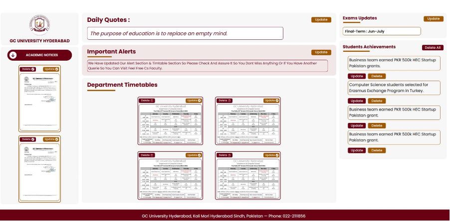
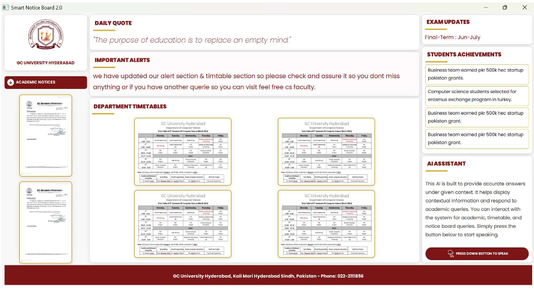
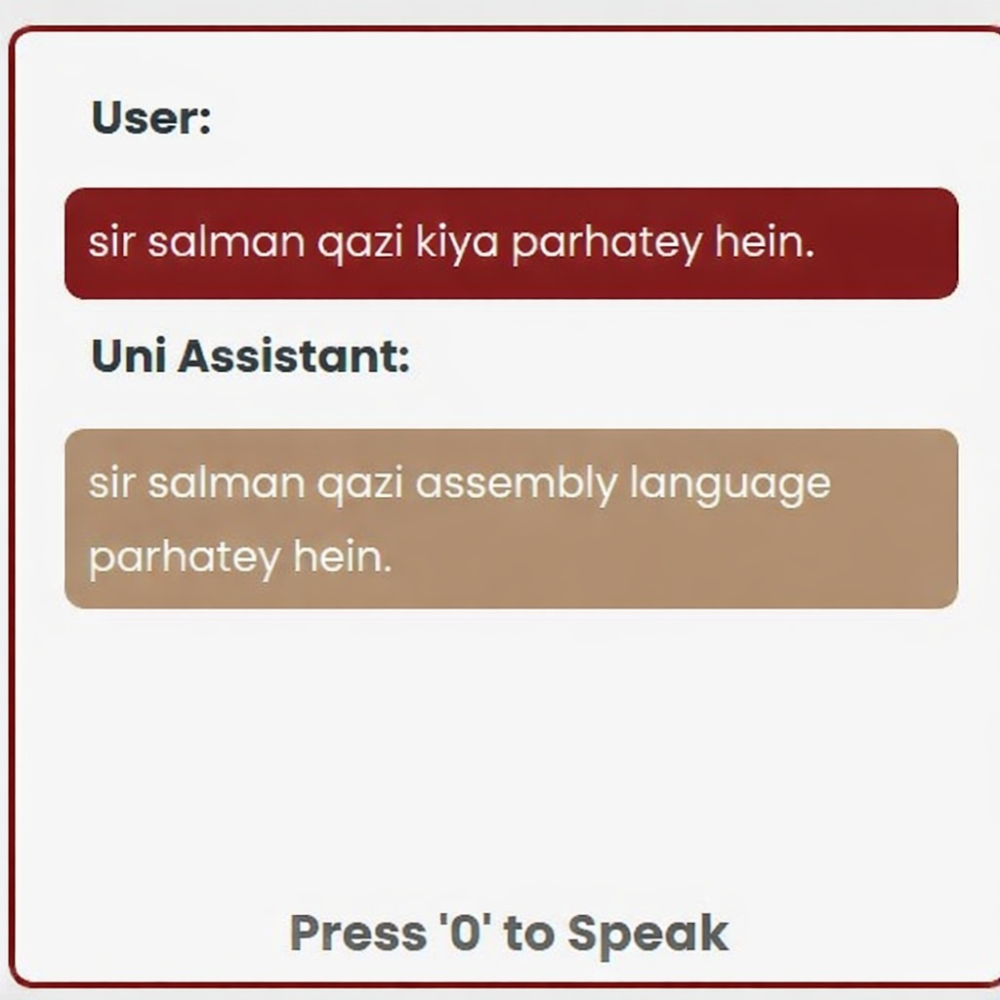

# 🚀 AI Notify Hub

AI Notify Hub is a **Smart Digital Notice Board System** designed to replace traditional paper-based notice boards with a **real-time, centralized, and AI-powered solution**.

---

## 📌 Overview

This system allows administrators to manage notices, timetables, alerts, and announcements through a web-based admin panel.

All updates are instantly displayed on a **smart LCD/LED screen** via internet.

It also includes an **Voice AI assistant** for answering university-related queries.

---

## 🎯 Features

* Real-time Notice Display
* Timetable Management
* Important Alerts
* Exam Schedule
* AI Chatbot
* Student Achievements
* Admin Panel
* Instant Updates (Wi-Fi)
* Paperless System

---

## 🛠️ Tech Stack

* React.js
* Node.js
* Express.js
* MongoDB
* Python (PyQt5)
* Gemini API

---

## 📂 Project Structure

```
ai-notify-hub/
├── main_screen/
├── admin_portal/
├── README.md
```

---

## ⚙️ Setup & Run

### 1. Clone repo

```
git clone https://github.com/your-username/ai-notify-hub.git
```

### 2. Admin Panel

```
cd admin_portal
npm install
npm start
```

### 3. Backend

```
npm install
node server.js
```

### 4. LCD Display

```
cd main_screen
pip install -r requirements.txt
python main.py
```

---

## 📸 Screenshots


## *Admin Pannel Dashboard*

## *Main Screen*

## *Chatbot Screen*



## 🔮 Future Work

* Mobile App
* Multi-campus support
* Role-based admin
* Advanced AI
* Analytics

---

## ⭐ Final Note

This project provides a **modern, automated, and intelligent system** for university communication using AI and real-time technologies.
